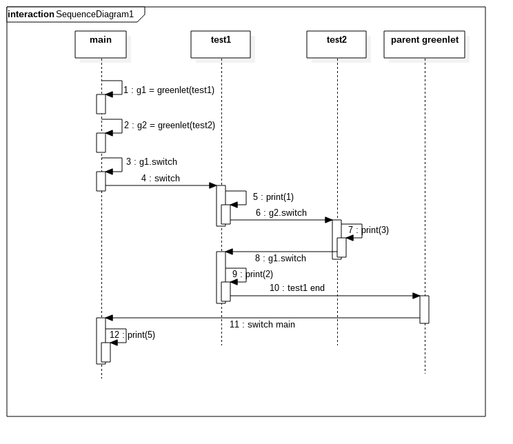

### eventlet“并发”原理

***

eventlet主要提供三个类来实现并发。

1. 基于协程的“并发”（greenPool）
2. 基于线程池的并发（tpool）
3. 基于管道的并发（subprocess）

###### 基于协程的“并发”

***

协程的“并发”是一种伪并发，它们是在同一个本地线程中，由hub调度管理器进行调度。hub管理器根据协程注册的timer和socket/io读写事件对协程回调。传统的进程和线程并发是基于抢占cpu时间片。协程是根据g.switch进行协程间的切换。每一段时间只有一个协程在工作，然后自己调用g.switch来决定切换到哪个协程。这样的话优点是程序可控，不会造成脏数据。而且可以通过协程+线程+进程的方式实现真正的并发。

greenlet最原始协程([参考](http://greenlet.readthedocs.io/en/latest/))

```python
#greenlet(run=None, parent=None)
from greenlet import greenlet
def test1():
    print("1")
    g2.switch()
    print("2")
def test2():
    print("3")
    g1.switch()
    print("4")

if __name__ == '__main__':
    g1=greenlet(test1)
    g2=greenlet(test2)
    g1.switch()
    print("5")
```

```python
#运行结果
1
3
2
5
当主程序运行到g1.switch,它会切换到test1函数，然后print("1")。当执行
到g2.switch会暂停test1，然后切换到test2函数，print("3"),然后调用
g1.switch会暂停test2,切换到test1，从暂停的位置执行，print("2")。当
test1执行结束，会调用g1的父greenlet。父greenlet会结束整个协程，回到
main暂停的地方,打印5。由于g1,g2有共同的父greenlet，所以没有打印4。
```



 eventlet.spawn(func, *args, **kwargs)创建协程([参考](http://eventlet.net/doc/index.html#))


```Python
在使用eventlet.spawn创建协程(GreenThread继承greenlet)的时候，它会向hub注册自己的调度时间或者socket、io读写事件，等时间到或者有io请求的时候会switch该协程。它与greenlet的区别是，引入hub来管理协程。
#调用eventlet.spawn创建协程
# source in greenthread class
def spawn(func, *args, **kwargs):
	#获取单例hub
	hub = hubs.get_hub()
	#创建协程，将hub.greenlet作为该协程的父协程。目的是当该协程运行结束或者异常时能由hub进行处理。
    g = GreenThread(hub.greenlet)
	#将自己注册到hub的schedule 
	#param1:elapse time
	#param2:时间到时，hub会调用g.switch，g.switch会运行下面用户func
	#剩下的参数是一个用户函数 func(*args,**kwargs)
    hub.schedule_call_global(0, g.switch, func, args, kwargs)
	return g

# eventlet.GreenThread是继承greenlet，然后加上Event对象和hub.greenlet作为父greenlet。
class GreenThread(greenlet.greenlet):
    def __init__(self, parent):
        greenlet.greenlet.__init__(self, self.main, parent)
        self._exit_event = event.Event()
        self._resolving_links = False
    #g.switch的执行main函数，它负责执行用户function和被linked的函数    
    def main(self, function, args, kwargs):
        try:
            result = function(*args, **kwargs)
        except:
            self._exit_event.send_exception(*sys.exc_info())
            self._resolve_links()
            raise
        else:
            self._exit_event.send(result)
            self._resolve_links()
```

```python
#GreenThread协程，官方推荐使用spawn()创建，而不是自己手动使用GreenThread类创建。主要原因是要向hub注册自己。
import eventlet
def test1():
    print("1")
    print("2")
def test2():
    print("3")
    print("4")

if __name__ == '__main__':
    g1=eventlet.spawn(test1)
    g2=eventlet.spawn(test2)
    eventlet.sleep(0)
    print("5")
```

```python
#运行结果
1
2
3
4
5
当主程序运行到eventlet.sleep(0)，程序会切换到hub.greenlet，hub会扫描调度表，然后g.switch到对应的协程。
hub先是调用g1.switch到test1，打印1,2后，test1运行结束自动切换到父greenlet，即hub.greenlet。hub再次扫描调度表，调用g2.switch到test2,打印3,4。test2运行结束会切换到hub。hub g.switch到main。为什么hub会回
到main，先看下eventlet.sleep()源码。
def sleep(seconds=0):
    hub = hubs.get_hub()
    current = getcurrent()
    timer = hub.schedule_call_global(seconds, current.switch)
    try:
        #切换到hub
        hub.switch()
    finally:
        timer.cancel()
当sleep时，也会将自己的greenlet注册到hub中，然后hub会switch到main，继续执行sleep()下面的代码。

```


```python
#GreenThread阻塞例子
import eventlet
def test1():
    while True:
        for i in xrange(2):
            print(i)
def test2():
    print("3")
    print("4")

if __name__ == '__main__':
    g1=eventlet.spawn(test1)
    g2=eventlet.spawn(test2)
    eventlet.sleep(0)
```

```python
#运行结果
只会循环打印 0,1，test2不会运行。因为test1没有调用hub.switch到hub.greenlet。结果导致hub不能调用g2.switch到test2。即当一个协程持续执行时，其它协程将得不到运行机会。
```

```python
#改进v1版本
import eventlet
def test1():
    while True:
        for i in xrange(2):
            print(i)
            eventlet.sleep(0)
def test2():
    print("3")
    print("4")

if __name__ == '__main__':
    g1=eventlet.spawn(test1)
    g2=eventlet.spawn(test2)
    while True:
        eventlet.sleep(0)
sleep是用来从当前协程切换到hub协程，从而test2可以运行。这样虽然可以达到需求，可是循环调用eventlet.sleep(0)会导致占用大量的cpu资源。
```

```python
#改进v2版本，使用协程池
import eventlet
from eventlet.greenpool import GreenPool
def test1():
    while True:
        for i in xrange(2):
            print(i)
            eventlet.sleep(0)
def test2():
    print("3")
    print("4")

if __name__ == '__main__':
    concurrency=2
    coroutinePool=GreenPool(concurrency)
    g1=coroutinePool.spawn(test1)
    g2=coroutinePool.spawn(test2)
    coroutinePool.waitall()
    

coroutinePool.waitall()调用的是eventlet event类的wait()。当执行到
该函数时，会阻塞当先协程，直到pool的所有协程执行完。event是一个先进先出
的队列类。因为greenlet可能需要函数返回值。当需要返回值的时候或者用于协
程之间的值传递，可以使用event.send()。注意任意一个协程阻塞会导致全部的协程阻塞，因为无法切换到hub，所以hub也就不能切换到其他协程。

```


下面看看eventlet.event的部分源代码

event.wait(self)

```python
 def wait(self):
        current = greenlet.getcurrent()
        if self._result is NOT_USED:
            self._waiters.add(current)
            try:
                return hubs.get_hub().switch()
            finally:
                self._waiters.discard(current)
        if self._exc is not None:
            current.throw(*self._exc)
        return self._result
```

event.send(self, result=None, exc=None):

```python
 def send(self, result=None, exc=None):
        
        assert self._result is NOT_USED, 'Trying to re-send() an already-triggered event.'
        self._result = result
        if exc is not None and not isinstance(exc, tuple):
            exc = (exc, )
        self._exc = exc
        hub = hubs.get_hub()_do_send(self, result, exc, waiter)
        for waiter in self._waiters:
            hub.schedule_call_global(
                0, self._do_send, self._result, self._exc, waiter)
```

event._do_send(self, result, exc, waiter)

```python
def _do_send(self, result, exc, waiter):
        if waiter in self._waiters:
            if exc is None:
                waiter.switch(result)
            else:
                waiter.throw(*exc)
```

当一个协程(g1)期望其它协程给他传值时，可以向g1绑定一个Event对象，然后调用event.wait()，这时会阻塞当前协程，switch到hub。其它协程可以调用event.send(result)向g1传递result。hub 扫描schedule_call_global，当send注册的时间到时，它会调用\_do_send函数，_do_send会调用waiter.switch，然后switch到g1协程的wait，wait检测到有返回值时，则return result。无论是wait还是send，都会调用hub.switch。

```python
#例子1，主线程向协程传递值
from eventlet import event
import eventlet
evt = event.Event()
def wait_on():
    retval = evt.wait()
    print("waited for {0}".format(retval))
if __name__ == '__main__':
    eventlet.spawn(wait_on)
    evt.send('result')
    eventlet.sleep(0)  
```


```python
#例子2，协程之间值传递
from eventlet.greenpool import GreenPool
from eventlet import event
def test1(evt):
    result=evt.wait()
    print(result)
def test2(evt):
    evt.send("test2 value")
if __name__ == '__main__':
    g1event=event.Event()
    concurrency=2
    coroutinePool=GreenPool(concurrency)
    g1=coroutinePool.spawn(test1,g1event)
    g2=coroutinePool.spawn(test2,g1event)
    coroutinePool.waitall()
```


class GreenPool(object) 部分源码分析([参考1](http://greenlet.readthedocs.io/en/latest/)，[参考2](http://eventlet.net/doc/index.html#))

GreenPool用来创建协程池。

```python
def __init__(self, size=1000):
  		#协程数量
        self.size = size
        #运行的协程集合
        self.coroutines_running = set()
        #表示协程资源的信号量
        self.sem = semaphore.Semaphore(size)
        #协程运行完成时事件队列
        self.no_coros_running = event.Event()
```

```python
def spawn(self, function, *args, **kwargs):
  		#如果协程池已满而且该协程已经创建，则直接运行
       current = greenthread.getcurrent()
        if self.sem.locked() and current in self.coroutines_running:
            gt = greenthread.GreenThread(current)
            gt.main(function, args, kwargs)
            return gt
        else:
          	#申请协程资源
            self.sem.acquire()
            #创建协程
            gt = greenthread.spawn(function, *args, **kwargs)
            #创建协程完成时时间队列
            if not self.coroutines_running:
                self.no_coros_running = event.Event()
            #将新创建的协程添加到协程运行时集合
            self.coroutines_running.add(gt)
            #用户function完成时，回调_spawn_done，用来回收资源
            gt.link(self._spawn_done)
        return gt
```

```python
def waitall(self):
        assert greenthread.getcurrent() not in self.coroutines_running, \
            "Calling waitall() from within one of the " \
            "GreenPool's greenthreads will never terminate."
        if self.running():
            self.no_coros_running.wait()
```

```python
def _spawn_done(self, coro):
  		#释放信号量
        self.sem.release()
        if coro is not None:
          	#从集合中移除coro协程
            self.coroutines_running.remove(coro)
         #如果没有协程运行则通过event.send函数switch到no_coros_running.wait()，从而结束waitall()
        if self.sem.balance == self.size:
            self.no_coros_running.send(None)
```


```python
#例子1
from eventlet.greenpool import GreenPool
def test1():
    print("1")
    print("2")
def test2():
    print("3")
    print("4")
if __name__ == '__main__':
    size=2
    pool=GreenPool(2)
    g1=pool.spawn(test1)
    g2=pool.spawn(test2)
    pool.waitall()
    
#结果：
1
2
3
4
当程序执行到pool.waitall时，会阻塞当前协程或者线程等待池中所有协程完成。当test1完成时，g1协程会调用link的_spawn_done，从而释放g1资源。当test2完成时，同样通过link的_spawn_done函数释放资源，当没有运行的协程时，则通过no_coros_running.send(None)，结束pool.waitall()。greenpool是通过信号量来添加协程实现协程池。
```

###### 基于线程池的并发（tpool）

***

tpool是eventlet安全线程池库，它的主要用处是包裹“非绿色”操作。比如C Library通过系统调用的socket操作。还用一些大量计算和大量文件读写操作。

```python
#例子1
from eventlet import tpool
from eventlet.greenpool import GreenPool
import time
def compute():
    while True:
        print("computing")
        time.sleep(1)
def my_func():
    tpool.execute(compute)
def my_func2():
    print("func2")
if __name__ == '__main__':
    coroutinePool=GreenPool(2)
    coroutinePool.spawn(my_func)
    coroutinePool.spawn(my_func2)
    coroutinePool.waitall()
    

```

```python
#若不使用线程
from eventlet import tpool
from eventlet.greenpool import GreenPool
import time

def compute():
    while True:
        print("computing")
        time.sleep(1)
def my_func():
    compute()

def my_func2():
    print("func2")

if name == 'main':
    coroutinePool=GreenPool(2)
    coroutinePool.spawn(my_func)
    coroutinePool.spawn(my_func2)
    coroutinePool.waitall()

#则my_func2得不到运行机会，只有my_func运行完后my_func2才能运行。原因参考【基于协程的“并发”】章节。

```


tpool类部分源码分析([参考](http://eventlet.net/doc/threading.html#tpool-simple-thread-pool))

```python
#为了与hub通信
def tpool_trampoline():
    #全局response队列，为了与线程池中的线程通信
    global _rspq
    while True:
        try:
            #接收一个字符，说明有消息传来，该消息无关紧要，只是开关作用，为了取队列中的值
            _c = _rsock.recv(1)
            assert _c
        except ValueError:
            break  # will be raised when pipe is closed
            #检查reponse队列
        while not _rspq.empty():
            try:
                #获取队列值，e为event对象，rv为resultValue
                (e, rv) = _rspq.get(block=False)
                #调用event.send
                e.send(rv)
                #清空e,rv
                e = rv = None
            except Empty:
                pass

```

```python
#运行用户函数，twoker是在一个线程中
def tworker():
    #全局response队列，为了与线程池中的线程通信
    global _rspq
    while True:
        try:
            #从请求请求队列中获取任务
            msg = _reqq.get()
        except AttributeError:
            return  # can't get anything off of a dud queue
        if msg is None:
            return
        #获取用户函数，e为event对象，meth(args，kwargs)
        (e, meth, args, kwargs) = msg
        rv = None
        try:
            #执行用户函数
            rv = meth(*args, **kwargs)
        #如果是系统异常，则抛出。比如用户终止
        except SYS_EXCS:
            raise
        #非系统异常，则返回异常信息
        except EXC_CLASSES:
            rv = sys.exc_info()
        # test_leakage_from_tracebacks verifies that the use of
        # exc_info does not lead to memory leaks
        #将event对象和rv投递到response队列，tpool_trampoline函数进行处理
        _rspq.put((e, rv))
        #清空值
        msg = meth = args = kwargs = e = rv = None
        #发送一个字符，为了触发tpool_trampoline中的recv
        _wsock.sendall(_bytetosend)
```


```python
#用户调用该函数，将自己的函数导入到线程
def execute(meth, *args, **kwargs):
	#初始化线程池，green socket，连接hub
    setup()
   
    my_thread = threading.currentThread()
    #如果已经在线程中，则直接运行meth
    if my_thread in _threads or imp.lock_held() or _nthreads == 0:
        return meth(*args, **kwargs)
	#创建event对象
    e = event.Event()
    #投递任务队列
    _reqq.put((e, meth, args, kwargs))
	#等待meth运行完成
    rv = e.wait()
    #检测rv是异常还是返回值
    if isinstance(rv, tuple) \
            and len(rv) == 3 \
            and isinstance(rv[1], EXC_CLASSES):
        (c, e, tb) = rv
        if not QUIET:
            traceback.print_exception(c, e, tb)
            traceback.print_stack()
         #若是异常，则抛出
        six.reraise(c, e, tb)
    #没有异常则返回，meth的返回值
    return rv
```

```python
def setup():
    #_rsock,_wsock用来主线程和线程池中线程通信
    #_coro，创建线程与hub交互
    #_setup_already 线程池初始化标志位
    #_rspq用户函数执行完成返回值队列
    #_reqq任务队列，一个任务执行一个用户函数。该任务运行在线程池中
    global _rsock, _wsock, _coro, _setup_already, _rspq, _reqq
    if _setup_already:
        return
    else:
        _setup_already = True

    assert _nthreads >= 0, "Can't specify negative number of threads"
    if _nthreads == 0:
        import warnings
        warnings.warn("Zero threads in tpool.  All tpool.execute calls will\
            execute in main thread.  Check the value of the environment \
            variable EVENTLET_THREADPOOL_SIZE.", RuntimeWarning)
    _reqq = Queue(maxsize=-1)
    _rspq = Queue(maxsize=-1)

    # connected socket pair
    sock = socket.socket(socket.AF_INET, socket.SOCK_STREAM)
    sock.bind(('127.0.0.1', 0))
    sock.listen(1)
    csock = socket.socket(socket.AF_INET, socket.SOCK_STREAM)
    csock.connect(sock.getsockname())
    csock.setsockopt(socket.IPPROTO_TCP, socket.TCP_NODELAY, True)
    _wsock, _addr = sock.accept()
    _wsock.setsockopt(socket.IPPROTO_TCP, socket.TCP_NODELAY, True)
    sock.close()
    #绿化socket，采用非阻塞socket
    _rsock = greenio.GreenSocket(csock)

    for i in six.moves.range(_nthreads):
        t = threading.Thread(target=tworker,
                             name="tpool_thread_%s" % i)
        t.setDaemon(True)
        t.start()
        _threads.append(t)

    _coro = greenthread.spawn_n(tpool_trampoline)
    # This yield fixes subtle error with GreenSocket.__del__
    #切换到hub中
    eventlet.sleep(0)
```

用户通过调用tpool.execute来添加自己要运行的func，当第一次添加时，会调用setup对线程池初始化。再次tpool.execute调用，直接将该任务投递到任务队列，线程池中的线程会取该队列任务进行执行。当在tpool.execute再次调用tpool.execute则用户函数会在已经运行的func中运行。

tpool线程与普通线程的区别。tpool.execute可以阻塞当前协程，等待返回值。而普通线程则不能实现这样的同步获得返回值。


